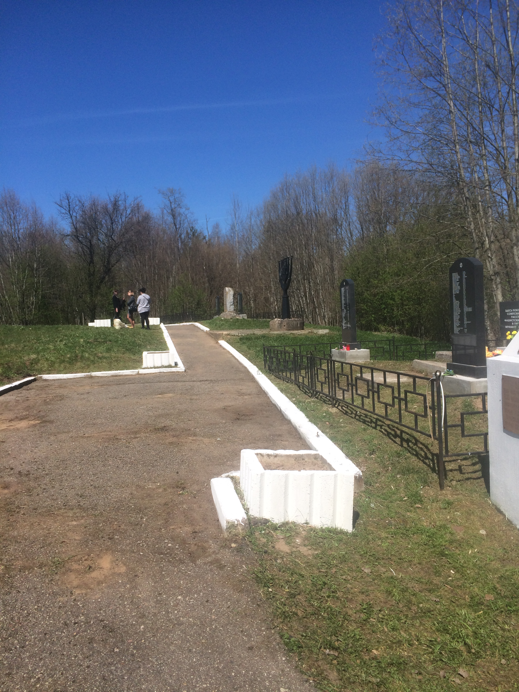
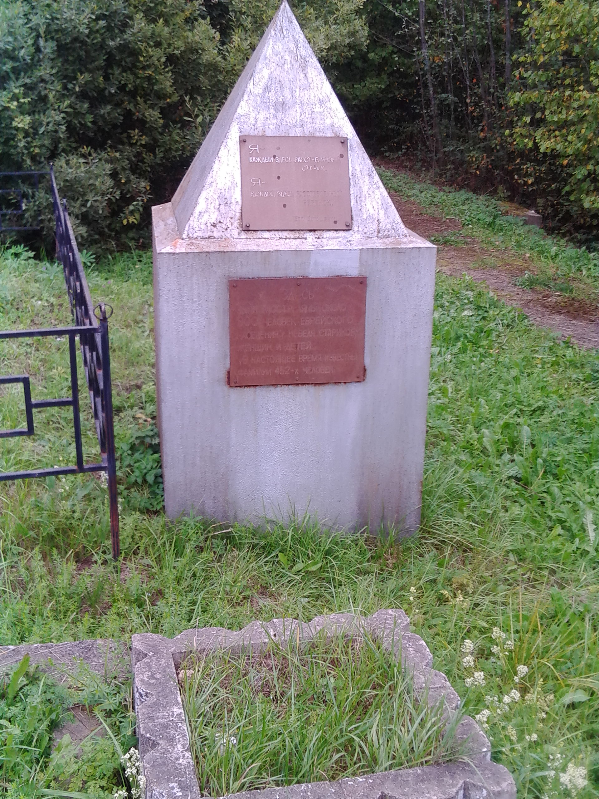
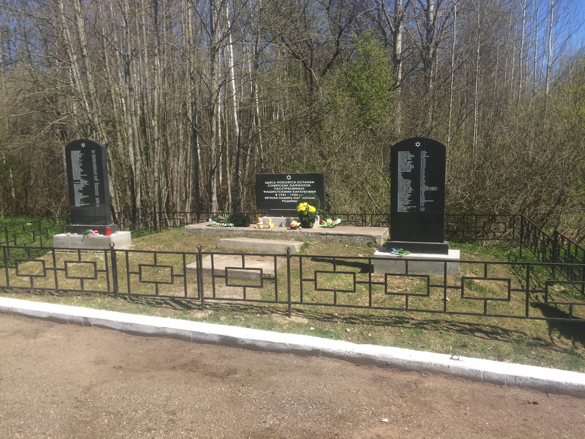
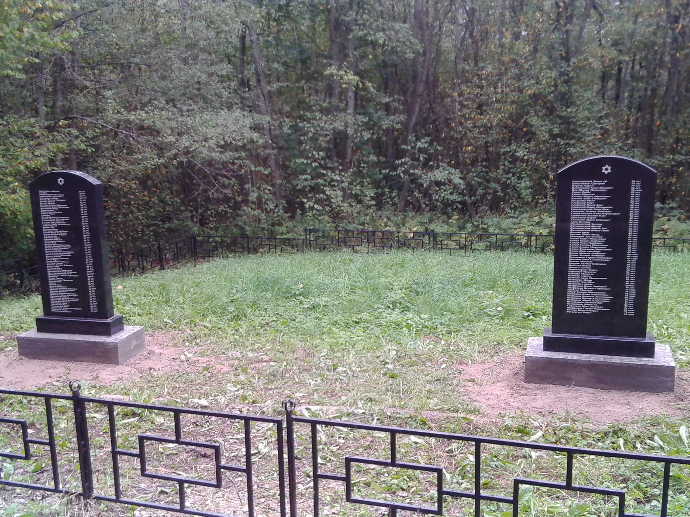
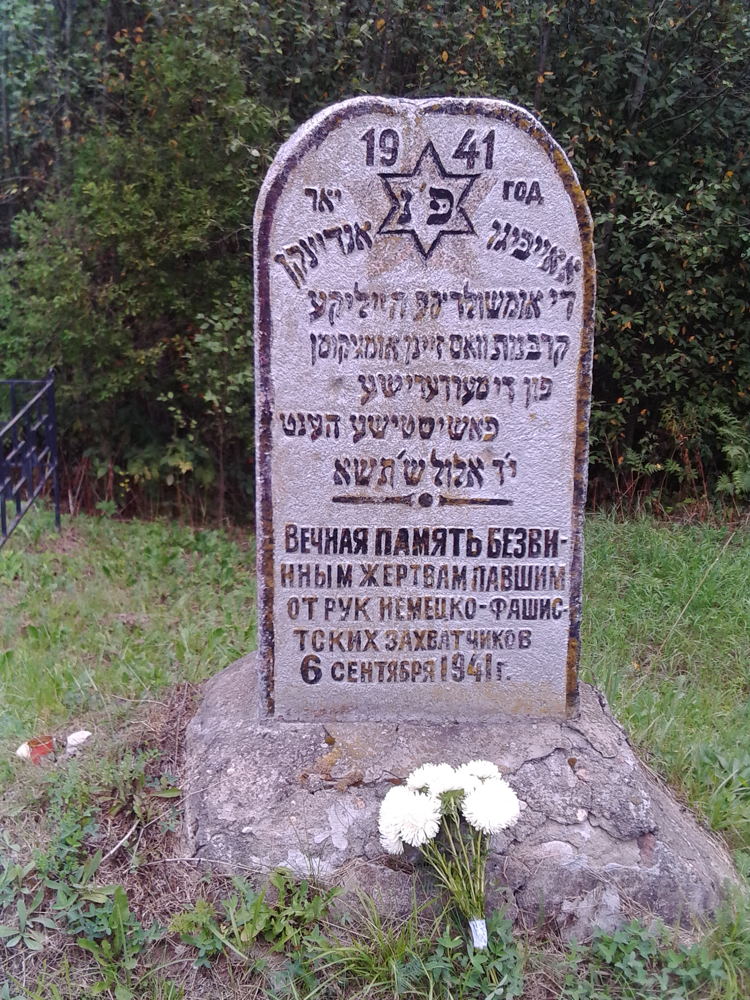
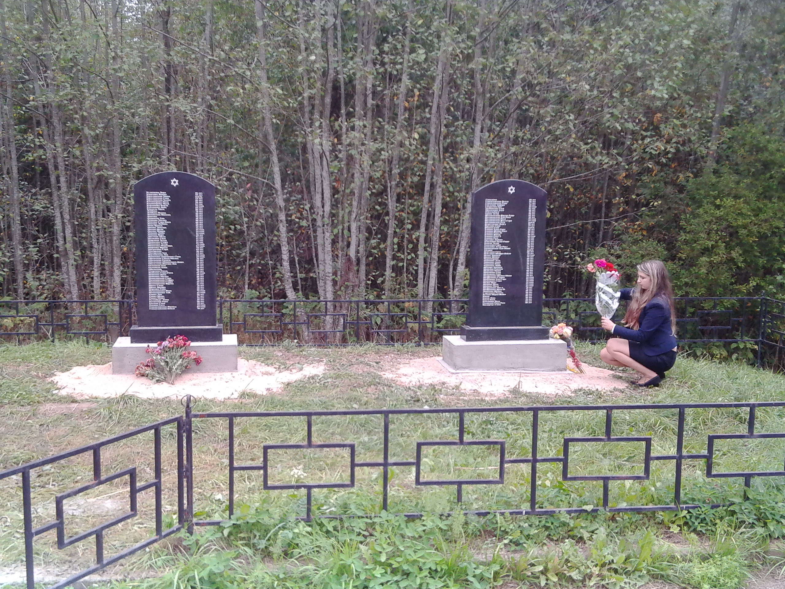

# Голубая Дача

Местечко «Голубая дача» расположено недалеко от города Невеля. Мемориал на еврейском кладбище и экспозиция рассказывают о расстрелянных здесь двух тысячах невельских евреев. Каждый может положить камешек в соответствии с древней традицией на могилы безвинно убитых детей, женщин, стариков. 

До Великой Отечественной войны в небольшом городе мирно уживались люди самых разных национальностей и вероисповеданий (русские и евреи, поляки и белорусы, литовцы и немцы); православные церкви и костелы, синагоги и кирхи соседствовали тогда в Невеле. Невель был оккупирован 15 июля 1941 года, и сразу начались расстрелы мирных жителей. По распоряжению немецкого командования 7 августа 1941 года бывшим бургомистром города Васильевым был издан приказ, обязывающий все еврейское население Невеля в трехдневный срок переселить на территорию загородного парка «Голубая дача». При активном участии полиции сюда было согнано около тысячи евреев: старики, женщины, дети.

6 сентября 1941 года началось уничтожение: сначала взрослых мужчин заставили выкопать ров – могилу, затем расстреляли. Детей отобрали у матерей и убили на их глазах, после этого расстреляли женщин. Многие были сброшены в противотанковый ров живыми – свидетели рассказывали, что земля на этом месте шевелилась три дня. По данным Чрезвычайной государственной комиссии всего в Невельском районе погибли 2 000 евреев.

В мемориал входят: кованый семисвечник – менора, высотой более двух метров (автор Л.Б. Ржевский), памятные обелиски, к захоронениям проложены асфальтовые дорожки. 

Работа по увековечиванию памяти погубленных нацистами евреев продолжается до сих пор, на памятниках появляются новые имена, которые удалось восстановить.

## Фотографии

  <figure style="margin: 0; text-align: center;">
    
    <figcaption><em>Центральная аллея мемориала</em></figcaption>
  </figure>
  <figure style="margin: 0; text-align: center;">
    
    <figcaption><em>Детский мемориал</em></figcaption>
  </figure>
  <figure style="margin: 0; text-align: center;">
    
    <figcaption><em>Детское захоронение</em></figcaption>
  </figure>
  <figure style="margin: 0; text-align: center;">
    
    <figcaption><em>Мужское захоронение</em></figcaption>
  </figure>
  <figure style="margin: 0; text-align: center;">
    
    <figcaption><em>Старое захоронение</em></figcaption>
  </figure>
  <figure style="margin: 0; text-align: center;">
    
    <figcaption><em>Женское захоронение</em></figcaption>
  </figure>

