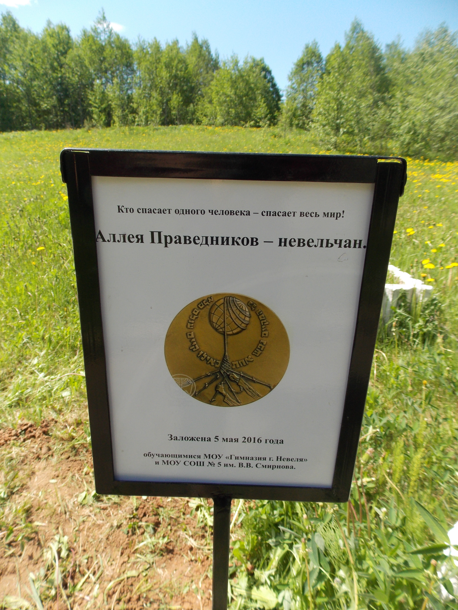
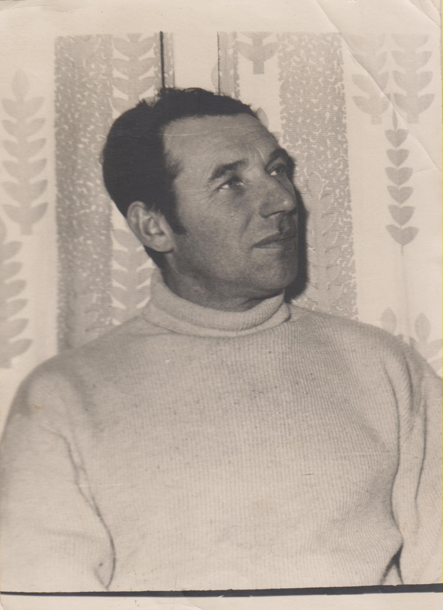
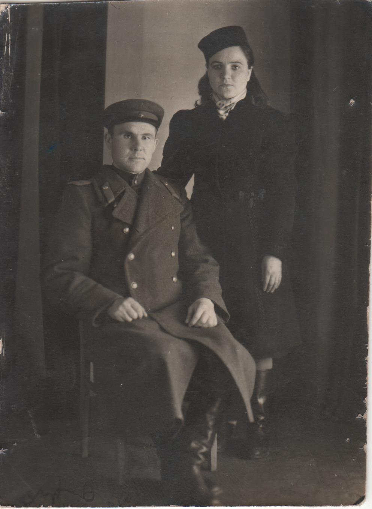
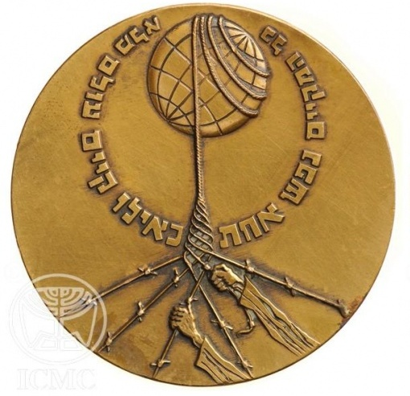
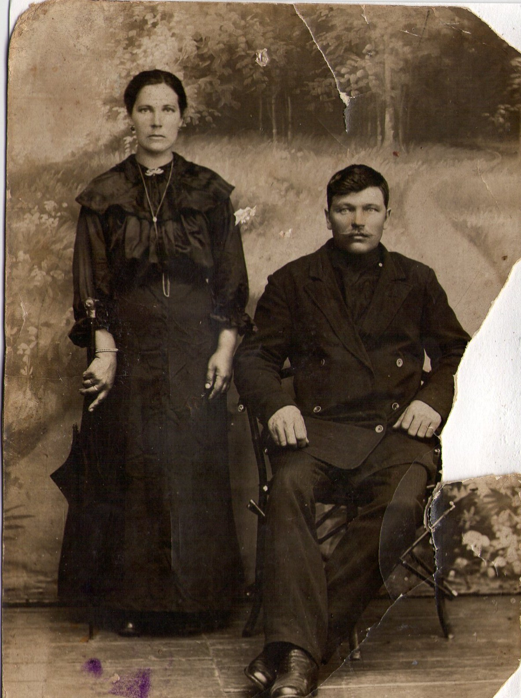

# Праведники Невельчане

## Информация о праведниках
- Свикис Герберт Генрихович
- Коровко Евдокия Ивановна
- Соловьева Анастасия Поликарповна
- Александра Ивановна Колондук
- Василькова Дарья Георгиевна

## Фотографии

  <figure style="margin: 0; text-align: center;">
    
    <figcaption><em>Аллея праведников</em></figcaption>
  </figure>
  <figure style="margin: 0; text-align: center;">
    
    <figcaption><em>Колондук</em></figcaption>
  </figure>
  <figure style="margin: 0; text-align: center;">
    
    <figcaption><em>Коровко Евдокия Ивановна с мужем</em></figcaption>
  </figure>
  <figure style="margin: 0; text-align: center;">
    
    <figcaption><em>Медаль Праведника народов мира</em></figcaption>
  </figure>
  <figure style="margin: 0; text-align: center;">
    
    <figcaption><em>Василькова Дарья Георгиевна с мужем</em></figcaption>
  </figure>
